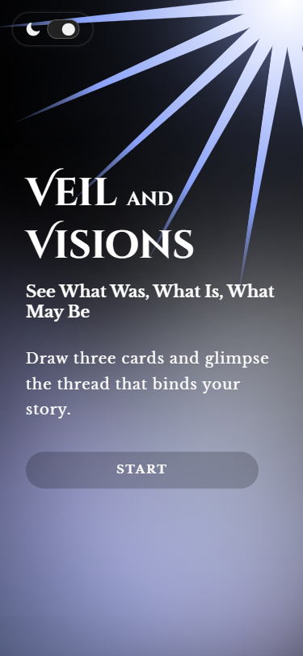

# 💻 Veil and Visions

## ℹ️ Veil and Visions - An Interactive and Responsive Tarot Reading Site

| _Mobile Preview (375x812)_                                   | _Desktop Preview (1440x960)_                                    |
| ------------------------------------------------------------ | --------------------------------------------------------------- |
|       |       |
|  |  |

Veil and Visions is a whimsical, interactive tarot web app that offers users randomized fortune readings through elegant card reveals and smooth animations, aesthetic design with DOM scripting, accessibility practices, and responsive layout techniques.

Created and inspired from the fortune telling lab challenge of the [**freeCodeCamp.org**](https://www.freecodecamp.org/learn/full-stack-developer/) JavaScript course.

---

## 🔍 Overview

This project simulates a digital tarot card reading experience. Users are greeted with a thematic intro and prompted to shuffle the deck. Upon clicking the "Draw" button, three cards are dealt onto the virtual table with animated transitions. Each card flips to display a fortune text which is crafted in the spirit of real divination tropes.

The site is fully responsive, supports dark mode, has accessible keyboard navigation and animations, and includes subtle sound design via background audio to create a mystical atmosphere. It’s designed mobile-first and adapts cleanly to various screen sizes.

---

## ✨ Features

- Animated shuffle and reveal card sequences
- Toggleable dark/light theme using a single switch
- Fortune text dynamically rendered per card
- Background sound effects for immersive effect
- Shuffle button resets the reading experience
- Fully responsive and accessible layout
- Custom SVG backgrounds with smooth gradients
- Google Lighthouse performance-optimized

---

## 🧠 What I Learned

- Managing DOM animations and transitions with JavaScript
- Making full use of the `<audio>` element with event listeners
- Handling card reveal logic through array manipulation
- Improving semantic HTML application with proper ARIA labels
- Creating smooth color transitions using `CSS variables`
- Practiced more on `setTimeout()` method in JavaScript
- Debugging interactive states and animation timing
- Applied the one function one action rule

---

## 🛠️ Tech Used

- HTML5
- CSS3
- JavaScript
- Git
- GitHub
- Netlify

---

## 🚀 How to Run

1. Clone the repository
2. Open `index.html` in your browser

---

## 🌐 Live Demo

Or you can check out the 👉 [live website here](https://veil-and-visions-fcc-jiro.netlify.app/)

---

## 📊 Performance Report

A **Google Lighthouse** audit was conducted on the final version of this project. You can view the full report [here](./assets/downloads/lighthouse-performance-report.pdf).

---

## 🧑‍💻 Author

Created by **Elmar Chavez**

🗓️ Month/Year: **July 2025**

📚 Journey: **4th** month of learning _frontend web development_.
